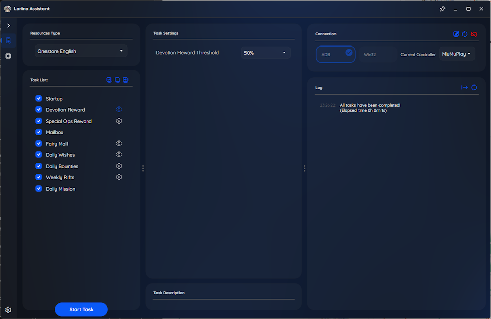

  

# Larina Assistant

Larina Assistant is here to help Human Gods doing their daily chores. This automation tool provides not-so comprehensive assistance for various in-game activities, making your dailies experience more efficient and enjoyable.

## Features

### Resource Collection

- [x] Devotion Rewards
- [x] SpecialOps Rewards
- [x] Missions Rewards
- [x] Mailbox
- [ ] Event

### Auto Battle
- [x] Wish
- [x] Bounty
- [x] Rifts
- [x] Squad Selection
- [ ] Dopamine
- [ ] Event

## Compatibility

- Tested on: 1920x1080 280 DPI MUMU Android emulator
    - Theoretical Support: 16:9 ratio below 1920x1080 (not guaranteed)
- Language: Currently supports English only
- Version: Auto start for OneStore version

## Getting Started

1. **Download** the latest release from the [Releases page](https://github.com/not-rzwei/LarinaAssistant/releases)
2. **Run** the application
3. **Set** your Android emulator connection
4. **Configure** the tasks you want to automate
5. **Profit** - enjoy automated daily chores!

## Community

We welcome contributions from the community! Whether you want to:
- Add support for different screen resolutions
- Implement new automation features
- Improve existing functionality
- Add support for other languages
- Fix bugs or improve performance

Please feel free to submit issues and pull requests.

## Acknowledgments

**Larina Assistant** is built on [MaaFramework](https://github.com/MaaXYZ/MaaFramework), a next-generation automation framework based on image recognition technology. It combines the refined development experience from [MAA](https://github.com/MaaAssistantArknights/MaaAssistantArknights) to create a powerful, extensible, and practical automation solution.